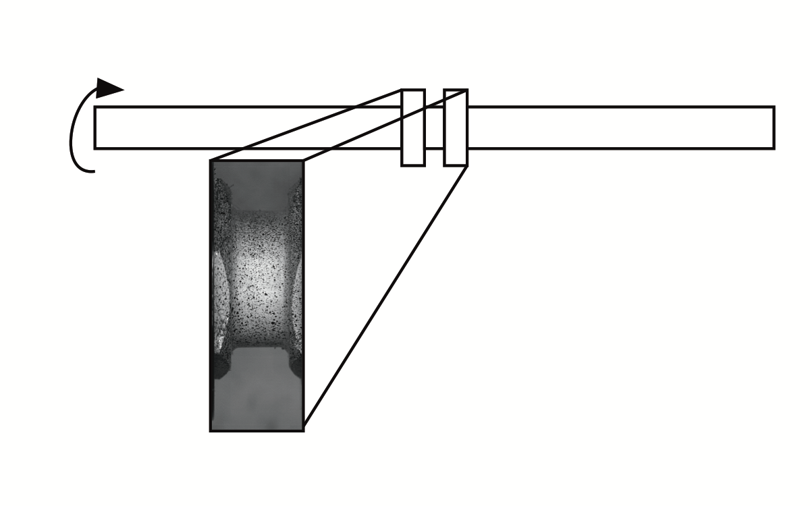
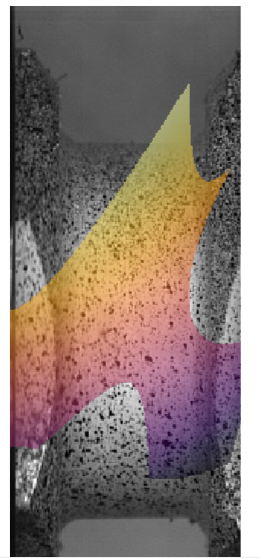

# DIC.jl
 *WIP!*

This package is a functional approach to DIC, where a polynomial can be fit to a displacement field. Typically, solutions are reached by finding a displacement vector for each of the intial pixels, creating a strain field. A functional approach would provide as much resolution that was added with polynomial coefficents as well as time derivatives, allowing for construction of strain rate plots. Fields such as SHPB testing (my background) are very interested in strain rate, and strain rate maps would be very interesting from a testing perspective.

To run, download julia, run add `add https://github.com/bhalonen/DIC.jl`.

Then, in the julia REPL in package mode run `test DIC` to run the tests.

To develop run `dev --local https://github.com/bhalonen/DIC.jl.git`.

Then run `julia --project` in the cloned directory. In package mode run `instantiate` then `test`.

## Results
The test case is run on a series of images taken on a sample that is being twisted in the following manner

Some intial results have been reached, however, this package remains a work in progress.

In particular, there seems to be an unstability with the solution, and often it converges to solutions that make little sense.

One issue may be the narrow window in which convergence actually occurs in. To stablize the functional approximation, perhaps a traditional FFT approach could be used to "stablize" the functional approach. In particular, it would provide an error function when the polynomial was guessing far away from the traditional solution.