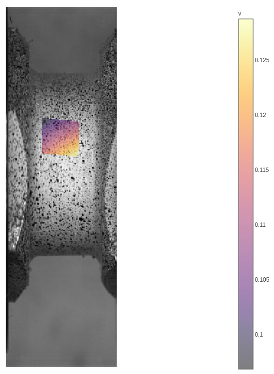

# DIC.jl

This package is a functional approach to DIC, where a polynomial can be fit to a displacement field.

To run, download julia, run add `add https://github.com/bhalonen/DIC.jl.git`.

Then, in the julia REPL in package mode run `test DIC` to run the tests.

To develop run `dev --local https://github.com/bhalonen/DIC.jl.git`.

Then run `julia --project` in the cloned directory. In package mode run `instantiate` then `test`.

## Results
Here are some intial results.

